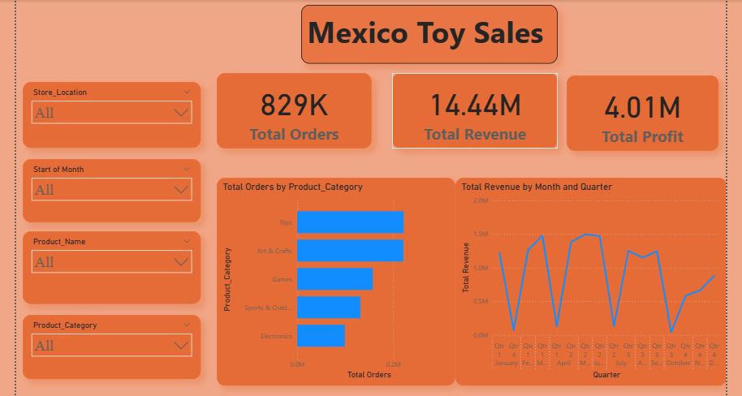

🧸 Maven Toys Sales Dashboard — Power BI Project
📖 Project Overview

This Power BI project analyzes sales performance for Maven Toys, a retail company specializing in toys and games. The goal was to transform raw transactional data into interactive dashboards that deliver actionable business insights.

🧩 Key Features

📊 End-to-End Report: Data import, cleaning, modeling, and visualization.

🎯 KPIs: Total Orders, Total Revenue, Total Profit, and Profit Margin.

🏪 Interactive Slicers: Filter by product category, store, and date.

📈 Visuals: KPI cards, bar charts, line charts, and donut visuals.

🗓️ Trend Analysis: Monthly and yearly insights to detect performance patterns.

💼 User-Friendly Layout: Designed for clear storytelling and decision-making.

🛠️ Tools & Technologies

Power BI

DAX (Data Analysis Expressions)

Power Query (ETL)

Data Modeling

Data Visualization

📂 Dataset

The dataset includes transactional sales data with columns such as:

Order ID, Product ID, Product Category, Store Location, Order Date, Revenue, and Profit.

(Dataset used for learning and demonstration purposes.)

## 📷 Dashboard Preview

🚀 Insights & Impact

Identified top-performing product categories and stores.

Revealed seasonal revenue patterns and monthly growth trends.

Helped improve business visibility and decision-making using Power BI.

🤝 About Me

I’m Muhammad Affaf, a Data Analytics & Business Intelligence Expert specializing in Power BI, DAX, and automation.

Follow me on LinkedIn
 for more analytics projects and collaboration opportunities.

🔖 Hashtags (for GitHub Tags)

#PowerBI #DataAnalytics #BusinessIntelligence #DAX #DashboardDesign #DataVisualization #MicrosoftPowerBI
